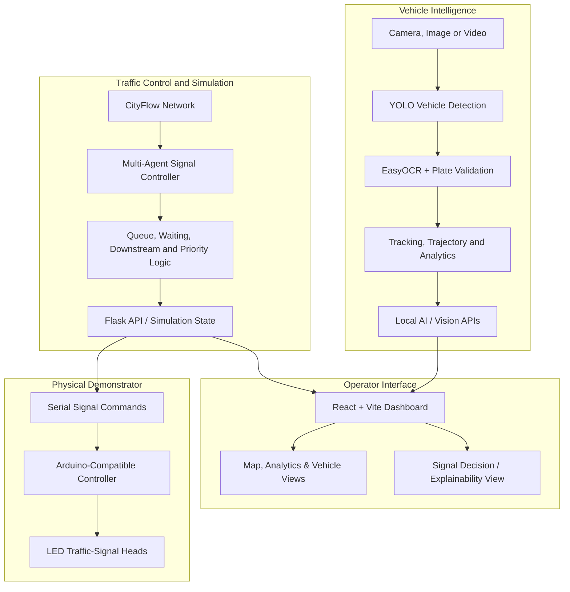

<p align="center"></p>

<p align="center">
  
</p>

<h1 align="center">VeROCiTI</h1>

<p align="center">
  <strong>Vehicle Location and City Traffic Intelligence</strong><br>
  An intelligent traffic-management prototype combining adaptive signal control, emergency green corridors, vehicle intelligence, an explainable dashboard, and a physical traffic-signal model.
</p>

<p align="center">
  <a href="#overview">Overview</a> ·
  <a href="#showcase">Showcase</a> ·
  <a href="#key-capabilities">Capabilities</a> ·
  <a href="#architecture">Architecture</a> ·
  <a href="#getting-started">Getting Started</a> ·
  <a href="#testing-and-benchmarks">Testing</a>
</p>

<p align="center">
  
  
  
  
  
</p>

---

## Overview

Urban traffic signals that rely on fixed schedules cannot always react to changing queue lengths, uneven demand, blocked roads, or emergency vehicles. VeROCiTI explores a more responsive approach: use traffic-state information to support adaptive signal decisions, coordinate priority for emergency vehicles, and make those decisions visible to operators.

VeROCiTI was developed as a **Smart India Hackathon (SIH) project submission** and was **shortlisted in the SIH internal round**. The project was also selected from KIIT Computer Science projects for a Japan Day showcase, where the team demonstrated the system to visiting Japanese business leaders.

The repository brings together several connected workstreams:

- A React-based monitoring dashboard for junction status, traffic information, and system operations.
- A CityFlow-based multi-agent traffic-control simulation.
- An emergency-vehicle green-corridor workflow.
- ANPR and vehicle-intelligence pipelines for image, video, and camera inputs.
- A physical traffic-junction model using Arduino-controlled LED signals.
- Supporting APIs, scripts, test cases, configuration files, and deployment assets.

> **Scope note:** This is a prototype and demonstration system, not a deployed city-wide traffic-control service. The checked-in CityFlow demonstration network contains five junctions (`J1`–`J5`). The wider city dashboard and map should not be interpreted as evidence that 100 real intersections are connected to live sensors.

## Showcase

### Physical demonstration model

<!-- PHOTO SLOT
1. Add your photo to: docs/showcase/physical-prototype.jpg
2. Replace the placeholder below with:
   <p align="center"></p>
-->

<p align="center">
  <em>📸 Physical prototype photo slot — add <code>docs/showcase/physical-prototype.jpg</code> and uncomment the image markup above.</em>
</p>

*Suggested photos: a wide shot of the complete board, a top-down view showing the junctions and LED signals, and a close-up of the Arduino wiring/vehicle setup.*

### Japan Day exhibition

<!-- PHOTO SLOT
1. Add your photo to: docs/showcase/japan-day-showcase.jpg
2. Replace the placeholder below with:
   <p align="center"></p>
-->

<p align="center">
  <em>📸 Japan Day showcase photo slot — add <code>docs/showcase/japan-day-showcase.jpg</code> and uncomment the image markup above.</em>
</p>

*Suggested photos: the team presenting the system, the full exhibition setup, and a photo showing the dashboard and physical model together.*

**Publishing note:** It is appropriate to include event photographs when you have permission to publish them. Before making the repository public with identifiable visitors in the images, check the event's photography rules and obtain consent where appropriate. Avoid adding private contact details, badges, or other sensitive information. Captions should describe the event accurately and must not imply that a company endorsed or partnered with the project unless that was explicitly agreed.

### Software dashboard

<!-- PHOTO SLOT
Add a dashboard screenshot at docs/showcase/dashboard.png, then replace this placeholder with:
<p align="center"></p>
-->

<p align="center">
  <em>📸 Dashboard screenshot slot — add <code>docs/showcase/dashboard.png</code> and uncomment the image markup above.</em>
</p>

---

## Key capabilities

### 1. Adaptive multi-junction traffic control

The CityFlow module models a connected five-junction network. Traffic agents evaluate traffic conditions and coordinate signal decisions rather than relying only on an identical fixed schedule.

The implemented control logic includes concepts such as:

- Queue- and waiting-time-aware direction priorities.
- Passenger-car-unit (PCU) weighting for mixed vehicle demand.
- Downstream congestion awareness to reduce the chance of sending more traffic into a blocked link.
- Bounded green timing and starvation prevention for directions that have waited too long.
- Support for incident/degraded-capacity scenarios and selected priority cases.

The simulation and controller are intended to be inspectable and testable. Their behavior should be evaluated using repeatable scenarios, not inferred from a dashboard screenshot alone.

### 2. Emergency-vehicle green corridor

VeROCiTI includes an emergency-priority workflow intended to coordinate signals along an ambulance route. In the CityFlow demonstration, the corridor uses connected junctions so that signals ahead of the emergency vehicle can be prioritized.

The project also includes a physical demonstration of coordinated LED traffic signals. In the showcased model, the team demonstrated a functioning green corridor for an ambulance.

### 3. Explainability and traffic-operations dashboard

The React frontend provides an operator-oriented view of the system. Depending on the selected view and connected service, it includes junction states, signal phases, queue information, traffic trends, alerts/incidents, vehicle information, and decision-reason text supplied by the traffic-control layer.

The purpose of the explainability view is to help an operator understand:

1. **What happened:** which signal phase or action is active.
2. **Why it happened:** the decision reason and relevant traffic context.
3. **What to inspect next:** queues, waiting, emergency priority, incidents, or control status.

Live status should always be interpreted alongside the connection indicator. Some views and fallback modes can use illustrative or locally generated state when a service is unavailable.

### 4. ANPR and vehicle intelligence

The vision-related modules support number-plate and vehicle analysis workflows for image, video, and camera inputs. The repository includes components for:

- Vehicle detection using Ultralytics YOLO models.
- Optical character recognition using EasyOCR.
- Plate-string normalization and format checks for Indian registration formats.
- Multi-frame processing and candidate voting in the applicable live-video pipeline.
- Vehicle tracking and trajectory-related data structures.
- Image-quality handling and supporting analytics.

Actual results depend on camera placement, resolution, lighting, motion blur, occlusion, and the input footage. Confidence scores are not a guarantee that a plate is correct; accuracy claims should be backed by a labelled, representative test set.

### 5. Physical traffic-signal prototype

The hardware work demonstrates the software-to-signal concept on a tabletop road network using an Arduino-compatible controller and LED signal heads. The board firmware is located at:

`hardware/verociti_board/verociti_board.ino`

The hardware documentation includes setup guidance for the board, camera calibration, serial control, and the physical demonstration workflow:

[`hardware/README.md`](hardware/README.md)

Check the sketch's board configuration and pin mapping against the exact microcontroller and wiring before uploading firmware. Do not connect LEDs or external circuitry beyond the board's electrical ratings.

### 6. City map, incidents, and vehicle monitoring

The frontend includes map-based and dashboard views for traffic conditions, vehicle activity, and incident-oriented monitoring. The available behavior depends on which backend services and data sources are running. Map tiles and other external integrations may require internet access.

---

## Architecture

The repository is composed of several services and modules. The high-level flows are shown below; not every optional service is required for every demo mode.



### Request and control flow

- **Simulation:** CityFlow produces the traffic state used by the traffic-control logic. The backend exposes simulation state and control functions to frontend views.
- **Dashboard:** React components render current state and decision information received from the available APIs.
- **Vision:** camera/image/video input passes through detection and OCR components, with tracking and supporting analytics used where enabled.
- **Physical board:** the backend/board-control path sends signal states over serial communication to the microcontroller that drives the LED heads.

The physical demonstration is a prototype integration. It should not be treated as a certified traffic controller or connected to public-road infrastructure.

---

## Technology stack

| Area | Main technologies in the repository |
|---|---|
| Frontend | React 19, JavaScript, Vite, CSS |
| Maps and charts | Leaflet, Chart.js, `react-chartjs-2` |
| Backend APIs | Python, Flask, FastAPI/Uvicorn for the local vision engine |
| Traffic simulation/control | CityFlow configuration, Python multi-agent controller |
| Computer vision | Ultralytics YOLO, OpenCV, EasyOCR, Pillow, scikit-learn |
| Vehicle data | SQLite and supporting tracking/analytics modules |
| Physical prototype | Arduino firmware, LED signal heads, serial communication via `pyserial` |
| Operations and deployment | Windows launch scripts, Docker, Gunicorn, Render configuration, optional Firebase configuration |

---

## Repository layout

```text
VeroCiTi/
├── README.md                         # Project overview and setup
├── start.bat                         # Windows one-click launcher
├── launch.ps1                        # Launch orchestration
├── colab_verociti_gpu.py              # Local/Colab vehicle and plate inference service
├── Dockerfile                        # Container build
├── render.yaml                       # Render blueprint
├── .env.example                      # Optional environment configuration template
├── frontend/                         # React + Vite web application
│   ├── src/                           # Components, views, hooks and services
│   ├── public/                        # Public frontend assets and logo
│   └── package.json                   # JavaScript dependencies and scripts
├── city flow model/                  # Traffic control, CityFlow and Flask APIs
│   ├── agent.py                       # Multi-agent traffic-control logic
│   ├── server_standalone.py           # Standalone backend application
│   ├── board_api.py                   # Physical-board API/integration
│   ├── board_vision.py                # Camera-based board workflow
│   ├── tracking_api.py                # Tracking-related API
│   ├── features_api.py                # Traffic/vehicle feature APIs
│   ├── scripts/                       # Benchmarks and tests
│   ├── roadnet_5j.json                # Five-junction network
│   ├── flow_5j.json                   # Example traffic flows
│   └── requirements.txt               # Python dependencies
├── prototype/                        # ANPR, vehicle identity and analytics modules
├── hardware/                         # Physical demo-board documentation and firmware
│   └── verociti_board/verociti_board.ino
└── docs/                             # Design materials and documentation
```

Showcase images can be added under `docs/showcase/` using the filenames in the [Showcase](#showcase) section.

---

## Getting started

### Prerequisites

- **Windows is the simplest route** for the provided `start.bat` launcher.
- Python 3.10 or later.
- Node.js **20.19+ or 22.12+** for the Vite 8 frontend; a current LTS release is recommended.
- Git.
- Internet access for first-time package/model downloads and map tiles.
- Optional: a compatible NVIDIA GPU for faster local vision inference.
- Optional hardware: the physical board, compatible Arduino microcontroller, LED signal circuitry, USB cable, and camera/phone for board-vision mode.

### Option A — Launch the integrated demo on Windows

1. Clone or download this repository.
2. Open the project directory.
3. Double-click `start.bat`.
4. On first launch, allow time for dependency installation and model setup.
5. Follow the launcher logs if a service fails to start; the dashboard normally opens at `http://localhost:5173`.

The launcher coordinates the local services. Use its terminal/log output to distinguish a running service from a view that is showing fallback or illustrative data.

### Option B — Start the backend and frontend manually

Create and activate a Python virtual environment if possible.

**Terminal 1 — Flask backend**

```bash
cd "city flow model"
python -m venv .venv
```

Activate it:

```powershell
# Windows PowerShell
.\.venv\Scripts\Activate.ps1
```

```bash
# Linux/macOS
source .venv/bin/activate
```

Install Python dependencies and start the backend:

```bash
pip install -r requirements.txt
python server_standalone.py
```

**Terminal 2 — React frontend**

```bash
cd frontend
npm install
npm run dev
```

Open `http://localhost:5173`.

The standalone backend/frontend instructions bring up the main dashboard and backend. Vision inference and physical-board functionality may require their additional local service, hardware, camera calibration, and environment configuration.

### Optional — Run the local vision engine

From the repository root, after installing the Python requirements:

```bash
python colab_verociti_gpu.py
```

The service normally listens on local port `8000`. First startup can download model weights and may take time. GPU use depends on the installed PyTorch build and whether a compatible NVIDIA GPU is available.

### Optional — Configure team sign-in

The backend supports team accounts through the `TEAM_MEMBERS` environment variable. Generate the configured value using the repository utility:

```bash
python "city flow model/scripts/make_team_members.py" you@example.com:your-password
```

Set the resulting value in the environment or your deployment provider's secret settings. **Do not commit passwords, generated account hashes, private Firebase configuration, API secrets, or `.env` files.** Use private credentials and appropriate access controls for any deployment beyond a local demo.

For optional settings, start from [`.env.example`](.env.example) and the frontend's [`.env.example`](frontend/.env.example), where present.

---

## Physical board setup

For the board-specific steps—camera source, calibration, signal-head layout, serial connection, and troubleshooting—use the dedicated [hardware guide](hardware/README.md).

Before a live demonstration:

1. Confirm that the microcontroller is detected on the expected serial port.
2. Run a lamp test and verify each signal head against its junction/direction.
3. Confirm that the physical phase matches the phase shown by the controller.
4. Test the emergency corridor and verify that the system returns to ordinary control afterward.
5. Disconnect the serial feed in a controlled test and verify the documented failsafe behavior.

The exact pin map, board configuration, and controller count must match your physical build.

---

## Testing and benchmarks

The repository includes scripts covering controller behavior, emergency priority, signal coordination, incidents, pedestrian/bus priority, degradation behavior, and the board pipeline. Examples include:

```bash
python "city flow model/scripts/benchmark.py"
python "city flow model/scripts/test_ambulance_corridor.py"
python "city flow model/scripts/test_green_wave.py"
python "city flow model/scripts/test_board_pipeline.py"
python "city flow model/scripts/test_pedestrian_phase.py"
```

Run scripts from the repository root unless a script's own instructions say otherwise. Some tests require optional packages, simulation assets, a configured camera, or hardware; the physical board tests may offer synthetic or hardware-free modes.

### Reporting performance responsibly

When comparing adaptive control with fixed-time control, keep the traffic demand and simulation conditions comparable. Record the metrics, configuration, number of runs, and any random seeds used. Typical metrics include:

- Mean travel time.
- Mean waiting time.
- Queue length.
- Throughput or completed trips.
- Emergency corridor response and recovery behavior.

Do not treat one simulation run as proof of real-world improvement. Publish numerical claims only when the underlying output can be reproduced and the comparison method is documented.

---

## Data, privacy, and limitations

- **Not a live government registration lookup:** the current prototype does not connect to the official Vahan/Parivahan registration database. Some registration/owner records are simulated for demonstration; do not use them for enforcement or real-world decisions.
- **Vision accuracy is scenario-dependent:** performance varies with lighting, plate visibility, camera angle, weather, motion blur and vehicle occlusion. The presence of an OCR result does not guarantee that it is correct.
- **Prototype scale:** the supplied CityFlow configuration is a five-junction demonstration network. A larger dashboard grid or city map does not mean those junctions are physically connected or validated.
- **Simulation versus deployment:** successful simulation and tabletop tests do not establish readiness for controlling public-road signals.
- **Privacy:** use video and plate data lawfully, restrict access, avoid exposing personal information in screenshots, and apply an appropriate retention policy for collected data.
- **Operational safety:** test with the tabletop model or simulation only. Real traffic-signal deployment would require certified equipment, robust safety interlocks, authorization, field validation and applicable regulatory approval.

---

## Configuration and deployment

- **Windows local demo:** `start.bat` and `launch.ps1`.
- **Container:** [`Dockerfile`](Dockerfile).
- **Render:** [`render.yaml`](render.yaml); required secrets should be configured in the deployment dashboard.
- **Firebase:** optional frontend/backend configuration templates are provided where applicable.

Deployment behavior depends on environment variables, available model resources, external services, and hosting limits. Validate every feature in the target environment rather than assuming the local demo and hosted deployment behave identically.

---

## References

- [CityFlow traffic simulator](https://github.com/cityflow-project/CityFlow)
- [Ultralytics YOLO](https://docs.ultralytics.com/)
- [EasyOCR](https://github.com/JaidedAI/EasyOCR)
- [OpenCV](https://opencv.org/)
- [React](https://react.dev/)
- [Vite](https://vite.dev/)
- [Flask](https://flask.palletsprojects.com/)
- [Arduino](https://www.arduino.cc/)

## Acknowledgements

Developed as a team project for the Smart India Hackathon submission and demonstrated at KIIT's Japan Day exhibition. Add team member names, faculty mentors, and other acknowledgements here if everyone involved is comfortable being credited publicly.

---

<p align="center">
  <strong>VeROCiTI — making traffic-control decisions more adaptive, coordinated, and understandable.</strong>
</p>
